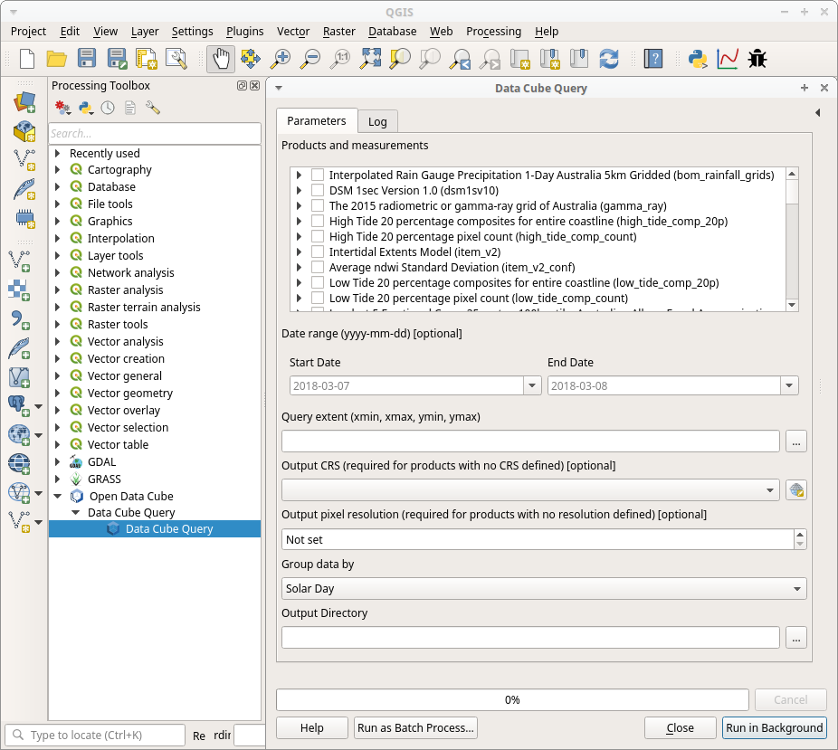

Open Data Cube QGIS Plugin
==========================

A QGIS 3 processing plugin to query and return data in GeoTIFF format from an Open Data Cube.

.. contents:: **Contents**

Users
-----
Documentation `datacube-qgis.readthedocs.io <https://datacube-qgis.readthedocs.io>`_
....................................................................................

Developers
----------

The Data Cube plugin is a processing plugin as opposed to a docked or panel type plugin.
This was done to reduce PyQt UI development, but it is a little restrictive for future development (of
user interface features).

There is scope to add more tools (processing algorithms) to the toolbox (provider).  This can be done by
writing a ``datacube_query.algs`` class that subclasses ``datacube_query.algs.__base__.BaseAlgorithm``,
importing that class in ``datacube_query.provider`` and appending the class to
``datacube_query.provider.DataCubeQueryProvider.algs``.

Building and testing
....................
There are some make files (win and *nix) to run tests and build a zipped plugin and/or static docs.

    make        # default target, will run make clean, make doc and make build
    make build  # build the plugin from the current source tree
    make doc    # build the static docs
    make clean  # explicitly clean up the source tree
    make test   # run the tests

Documentation
.............
There's no API documentation as such. The plugin code is only meant to be used from a GUI, but the code is fairly well
commented.  The user docs are static HTML included with the zipped plugin file, and also are automatically
built at `datacube-qgis.readthedocs.io <https://datacube-qgis.readthedocs.io>`_ from a commit hook to
the github repo.

Links
.....

There isn't a great deal of QGIS 3 plugin development documentation yet.  Some links below:
 - `QGIS Python API <http://python.qgis.org/api/index.html>`_
 - `QGIS Plugin Builder plugin <https://github.com/g-sherman/Qgis-Plugin-Builder/tree/qgis3_version>`_ (qgis3 source version, not released on QGIS Plugins repo)
 - `Rough beginnings of processing algorithm porting guide <https://github.com/qgis/QGIS/pull/4841>`_
 - `Plugin migration to QGIS 3 <https://github.com/qgis/QGIS/wiki/Plugin-migration-to-QGIS-3>`_
 - `Core QGIS Processing source <https://github.com/qgis/QGIS/tree/master/python/plugins/processing>`_

