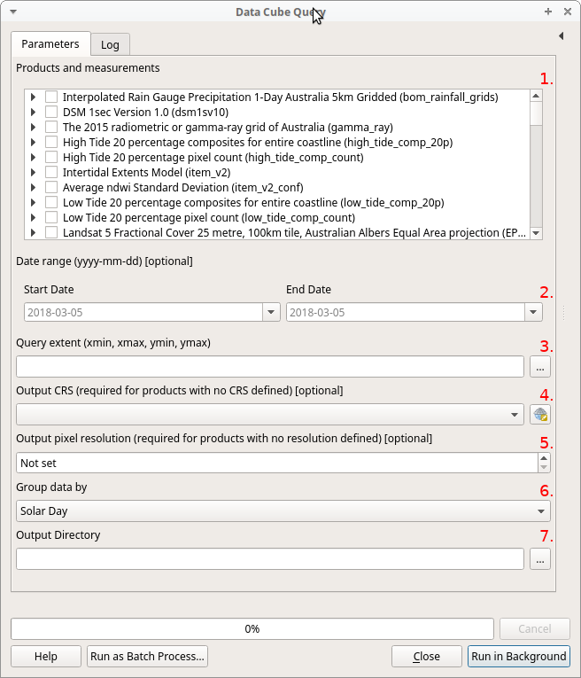

Data Cube Query
===============
A QGIS 3 processing plugin to query and return data in GeoTIFF format from an Open Data Cube.

Parameters
~~~~~~~~~~

1. Select one or more products and/or individual product measurements.

    If the algorithm can't connect to a running Data Cube instance, this list will be empty
    and the warning message "Unable to connect to a running Data Cube instance" will be displayed.

2. Specify a date range. This is optional.

3. Specify a query extent.  Click the `[...]` button to the right of the parameter to select the extent
from a layer/map canvas extent or by drawing a rectangle.

4. Specify an output coordinate reference system (CRS).  This is optional and will default to the CRS of each
selected product.

    This parameter is required for products that do not have a CRS defined.

5. Specify an output pixel resolution.  This is optional and will default to the resolution of each
selected product.

    This parameter is required for products that do not have a defined resolution.

6. Observation grouping method. One of Solar Day or Time.  For EO-specific datasets that are based around
scenes, the time dimension can be reduced to the day level, using solar day to keep scenes together.

7. The output directory.

----

Notes
~~~~~

    If a selected product does not have a CRS or pixel resolution defined and you do not specify
    either, that product will be skipped when the algorithm is run and a warning message will be shown in
    the log.

    If you specify an output CRS or resolution, this will be applied to all products you select, not
    just those that do not have a CRS or resolution defined.
